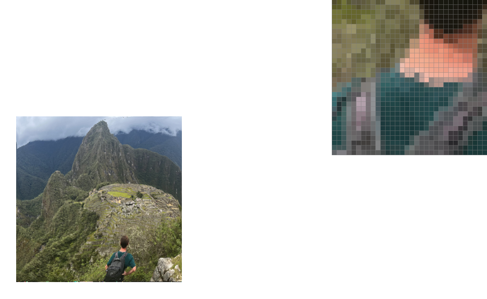
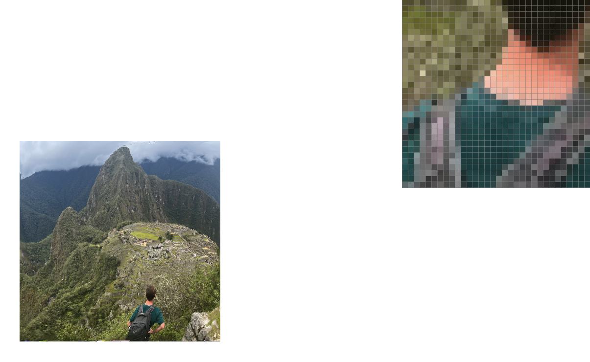

# Project 1: Rasterizer

## Project Overview

In this project, I implemented and explored various rasterization and sampling schemes for rendering two dimensional images. 
This encompasses very simple approaches, like basic nearest neighbor point sampling, to intermediate approaches such as supersampling, 
all the way to more advanced techniques such as trilinear texture sampling. One of my basic goals with this project is to visually 
demonstrate the differences in these approaches while also making note of the computational requirements of each technique. Additionally, 
although these techniques are all used within the context of this project to render two dimensional images, they could easily be extended 
or extrapolated to other tasks as well.

Additionally, as is the case with any academic project, great value is also yielded by the implementation of algorithms. Making note of 
various formulae and sets of equations on paper is one thing, but actually implementing them often requires digging into and understanding 
them at a much deeper level. 

## Task 1 - Basic Triangle Rasterization

To rasterize triangles, I made use of the 3 lines algorithm from the lecture slides. I first determine the coordinates of the bounding box 
of the triangle, that being the smallest rectangle that will contain all points in the triangle. From there I iterate through the image, 
sampling at every x + 0.5 and y + 0.5 coordinate, to make sure my sample comes from the middle of each box and that I sample every box that 
is inside the triangle. I have a helper function which implements the point in triangle test from lecture. I run this three times, once for 
each side of the triangle. If a given sample passes or fails all three tests, I draw it directly onto the screen. This results in a fully 
rendered triangle.

In terms of efficiency, this algorithm is linear with respect to the size of the bounding box of the triangle. Before I run any loops, I 
first find the minimum and maximum x and y coordinates across all three points. This defines my bounding box. I then iterate over all the 
samples in this box with a double for loop. Here is an illustration of the output, with the pixel selecter zoomed in on a triangle to
demonstrate the sort of artifacts this process produces.

## Task 2 - Supersampling

### Additional Data Structures

Unlike the previous task, my implementation of supersampling requires an additional data structure, that being a sample buffer. The 
sampling buffer is a 1D array which stores sampled pixels before they are drawn on the screen, allowing me to perform additional 
operations on the points before rendering. In supersampling in particular, this provides a temporary location to store svg pixels 
sampled at a higher rate which are then down sampled to the appropriate resolution. As an additional implementation note, because this 
array is 1D and needs to store 3D data (x and y corresponding to 2D location of each sample and the third dimension “s” corresponding 
to the number of the supersample within the x, y pixel) a clever indexing scheme is required to organize all the data. I settled on an 
indexing scheme of:
`sample_buffer[((y * width + x) * sample_rate) + s]`
Although this is not explicitly “row major order” it does organize everything in such a way so that all supersampled pixels can be 
neatly stored in the sample buffer.

### Algorithm

My supersampling algorithm is an extension of the previously described Task 1 algorithm. I make use of the three line test to determine 
whether or not a point is within the triangle as before, the main additions to the algorithm are which points are sampled and how they 
are processed once sampled.

The Task 1 algorithm made use of a double for loop to iterate through all the sample points. This algorithm makes use of a quadruple 
for loop or, perhaps more accurately, two double for loops. The first still iterates through all the potential x, y samples, while the
second is responsible for iterating through all the supersample points i, j within each x, y coordinate. The coordinates of these points are 
determined by repeatedly offsetting each x, y coordinate by multiples of `1 / sqrt(sample_rate)` until the next x, y coordinate would be 
reached. Each of these points then undergoes the three line test and is placed in the sample buffer with appropriate color. This has 
the net effect of antialiasing the triangles, by blending their original colors with an amount of the background color proportional to 
how many super sample points are inside or outside of the triangle.

Once in the sample buffer, the points require further processing. My algorithm works by summing the RGB values of all super sample 
points for a given x, y coordinate and then dividing by the total number of samples in order to average out the color. This has the 
effect of down sampling from a higher resolution to a lower one. One final note is that points and lines need to be handled specially, 
otherwise they would just appear to get lighter and later as the sampling rate increases due to not being super sampled and therefore 
having their colors incorrectly averaged with default background color pixels. To account for this, I simply changed `fill_pixel` to 
artificially “supersample” each point and line by placing `sample_rate` number of pixels of the sample color in the sample buffer. 
This means that when the color of a point or line is averaged with the other points, the average will always be equal to the original 
color of a point or line.

Sampling Rate = 1                   |  Sampling Rate = 4                     | Sampling Rate = 16
:----------------------------------:|:--------------------------------------:|:--------------------------------------:
    |        |  

**Sampling Rate = 1 (No Supersampling)** - The first image has no antialiasing. Note that there are only two distinct colors present 
on the inspector window, blue and white, with no gradations in between. Additionally, the triangle is not fully connected.

**Sampling Rate = 4** - This image demonstrates basic supersampling. Because we are now sampling the same pixel in multiple locations 
and averaging the color, there are more gradations available between white and red. Additionally, even if the center of a pixel is no 
longer located in the triangle, if it has nearby elements which are, we are likely to see some coloring in the output. Note however 
that the triangle is still not fully connected, indicating that this super sampling rate is still somewhat coarse.

**Sampling Rate = 16** - Aliasing is further reduced and the triangle is now fully (albeit using light colors) connected. Because the 
sampling rate is higher there is a range of 16 shades of red possible for each pixel, allowing more accuracy and precision in rendering.

## Task 3 - Translations

Translations are accomplished by using affine matrices to alter coordinates. Implementation of this part of the project was relativally 
straightforward, and in effect is consists largely of creating matrices. As for the creative portion of this part of the project:

I made the robot do the splits! To do this I had to add additional transforms to each of the four leg components of the robot. The first 
involved rotating the legs 90 degrees. From there, the legs were properly rotated, but still in the same positions as before, so I had 
to add additional translations and fiddle around with the numbers until I was able to get each component into the correct position. This 
exercise helped to illustrate the order of transformations matters. In particular, I first tried adding the additional rotation at the 
end of the starter code, only to find that it did not rotate the rectangle while maintaining its shape as I thought it would, but instead 
turned it into a kind of kite shape. I learned that the rotations had to occur before the scaling in order for things to render the way I 
wanted them to.

## Task 4 - Barycentric Coordinates

Barycentric coordinates allow for smooth interpolation of a texture across a rendered object. They work by characterizing a coordinate as 
a linear combination of three attributes, scaled by values alpha, beta, and gamma. Once alpha, beta, and gamma have been determined by 
solving a series of linear equations, they can be used to scale other coordinates, in this case texture coordinates, appropriately.

Here is an image showing a smoothly interpolated triangle. Notice that each color point is the result of a “blend” of the surrounding 
colors, or, to be more specific, each point inside the triangle represents a blend of color proportional to its distance from each corner 
of the triangle.

This image demonstrates the same effect as above but on a color wheel.

## Task 5 - Pixel Sampling

Much like going from Task 1 to Task 2, Task 5 is an extension of the work done in Task 4. In Task 4, we were given three colors and by 
calculating Barycentric values of alpha, beta, and gamma, were able to blend and proportion those colors appropriately. Similarly for Task 
5, we start, as before, by calculating alpha, beta, and gamma values. However, instead of directly using those values to average the colors, 
we instead use them to construct two new points, `u` and `v`. `u` and `v `are the result of taking a linear combination to the three pairs 
of given u, v texture ratios with Barycentric coordinates. From there, these two values are then used to return a texture mapping through either 
nearest sampling or bilinear sampling.

### Nearest Sampling 

This approach works by taking `u` and `v`, scaling them up to the width and height of the texture (because they initially start as ratios 
between 0 and 1), rounding that value to the nearest whole number, and finally sampling a texel from the mipmap at level 0. This method is 
simple and cheap to compute.

### Bilinear Sampling 

This approach is more complicated. I employed the triple lerp method from the lecture slides. I began by scaling my values of `u` and `v` 
and then flooring and ceiling them to create four pairs of coordinates representing the square created by finding the four nearest whole 
value pixel points on the texture. This resulted in eight different variables (2 for each point) with some redundant information, but I left 
the code this way intentionally so as to provide a clearer picture of the process. From there I took a lerp along the x axis of the horizontal 
pairs of points, and with that information further took a lerp along the y axis, using the previously lerped coordinates. This allowed me to 
effectively supersample the texture by averaging out the value of the four nearest points and returning the texel at that point. While more 
accurate, this method is somewhat more expensive than nearest sampling due to the additional math required to find the exact sample location.

| No Supersampling Nearest          | No Supersampling Bilinear                    
:----------------------------------:|:--------------------------------------:
    |        

These images are not supersampled, their only difference is that the left one uses nearest sampleing and the right uses bilinear. As is apparent, 
the bilinear image does a much better job at modeling the curves within the smeared Berkeley logo. This is because the bilinear version 
averages out the textures near the sample region rather than just selecting them as is the case in nearest. This means that bilinear sampling 
has a similar effect to super sampling because it will smooth large changes in texture by proportionally blending the sample texture with 
nearby points on the textmap.

| x16 Supersampling Nearest          | x16 Supersampling Bilinear                    
:----------------------------------:|:--------------------------------------:
    |        

These images are supersampled with a rate of 16. Although the bilinear image still does a better job at representing curves, as the supersampling 
rate increases the difference in quality becomes less apparent. This is expected because bilinear sampling is a process similar to super sampling, 
so when supersampling itself is enabled, the two processes begin to approach similar results. In general, one would expect to get the largest 
bilinear sampling effects on a non-supersampled image.

## Task 6 - Level Sampling

### Algorithm

Level sampling works by texturing an image based on a mipmap at a level determined according to the size of the rendered image. The first step is 
to determine at what level the mipmap should be sampled at. The starter code provides three pairs of u, v ratios which correspond to where in the 
sample texture the x, y coordinates of the triangle will map. We can use these coordinates to determine the relative area of the sample, thus 
allowing us to determine the appropriate sample level. To do this we first transform all three pairs of coordinates to their Barycentric 
representations to make sure they properly represent the ratios of the x, y coordinates that we want. These coordinates, along with additional 
information about which sample techniques we will be using to render a given image, are combined into a `SampleParams` struct which is then passed 
into the texture object.

All that information properly in place, we can actually calculate the level as a float. There are three settings:

**L_ZERO** - we default to always using level 0 of the mipmap

**L_NEAREST** - we transform the two additional sets of u, v Barycentric coordinates to pixel values and use them to calculate the size of the 
texture region which we are sampling as the difference in minimum and maximum x and y coordinates of the area. From there we calculate the mipmap 
level as `level = log2(max(diff_dx.norm(), diff_dy.norm()));` and round to the nearest integer.

**L_LINEAR** - the process here is the same as in `L_NEAREST`, the difference being that we leave the level unrounded.

The hard work of determining the appropriate mipmap level out of the way, we can now sample according to one of two techniques:

**P_NEAREST** - in this case we simply sample the mipmap as described in Task 5, the only difference being that we use the level we have calculated 
above. In the case that we determined the level linearly, we will default to using the floor of the level value.

**P_LINEAR** - in the case where we have a continuous level variable from the final level determination method), this option will in effect perform 
trilinear sampling as described in lecture. This means that we will floor and ceiling the level, giving us two different mipmap levels, sample from 
each, and then lerp the two resulting texture colors proportionally to the significance of the level value. In the case where level is a whole number 
(meaning the two first level determination methods), this case will behave the same way as `P_NEAREST` because the floor and ceiling of the level will 
be the same and therefore we will linearly interpolate between the same two values, yielding no change.

The below table illustrates some of the differences and trade offs of the various techniques explored throughout the project.

|     | Pixel Sampling             | Level Sampling                |   Supersampling    |
| ----------- | ----------- | ----------- | ----------- |
|Speed |Fastest method | Middle, if averaging across multiple mipmap levels can slow down further| Slowest method (when sampling rates are high) because in effect samples at a higher resolution and then down samples that image|
|Memory Usage|Minimal, all textures are directly rendered|Requires more memory as mipmap representation of texture is larger|Requires more memory the higher the sample rate, but in general use cases will be less memory intensive than level sampling and more so than pixel sampling|
|Antialiasing|Creates artifacts, fails to “blend” high frequency signals, pixelates high res images|Reduces aliasing by using more resolution appropriate images given a level. Can further reduce aliasing by blending textures of adjacent levels (trilinear sampling) which helps dramatically when zooming|Reduces artifacts by “blending” them with nearby textures. Smooths colors to make images appear much less jagged|

### An Example in Action

As a final demonstration, I present some of my own images sampled according to the techniques described above. Here is a picture of me at Machu Picchu 
from this past Winter break. This is the original image at a high resolution (or at least as high as my phone can take it) without any sampling 
techniques and no distortions with the other above methods.

The following three images all use `P_NEAREST` with varied level sampling methods.

This image is created with zero level sampling. Notice that there are a lot of artifacts here. Parts of the image almost look like pure noise. This 
is because the original image is a high resolution and is being down sampled. Whatever pixel is closest in the map gets rendered here, that means 
that if the colors of the image change quickly over a short range, they are unlikely to be well sampled, resulting in the extreme aliasing seen 
here. These issues are especially apparent in the pixel inspector, centered on my neck. The greenery around me is very noisy.

This image uses nearest sampling, meaning that all textures are taken from the most appropriate mipmap level of the image. This creates a smoothed 
effect. The full image appears somewhat blurry, but is overall more human parsable than the first. In the pixel inspector we can further see this. 
Instead of noise like particles in the greenery, there seem to be patches of relatively uniform color. This approach actually does create some 
additional artifacts as well. Notice that above Hyuna Picchu (the large mountain in the center) there are strange out of place pixels. Additionally, 
many of the clouds have a somewhat pixelated look.

This image uses linear sampling, meaning that it is sampling multiple mipmap levels. This produces far 
and away the best results. In the pixel inspect we see a happy medium between the first two renders. The texture is somewhat smoothed as in the 
second render, while retaining some of the randomness we would expect in the greenery which we had too much of in the first render. That noted, 
there are still some issues in that the final image does lack some blending.

The following images pairs are organized as follows: Those on the left are the same as the three just discussed above, those on the right are 
those images with the same level setting, but this time with different pixel sampling levels.

Level 0 `P_NEAREST`            | Level 0 `P_LINEAR`
:-------------------------:|:-------------------------:
|||

Level Nearest `P_NEAREST`            | Level Nearest `P_LINEAR`
:-------------------------:|:-------------------------:
|||

Level Linear `P_NEAREST`            | Level Linear `P_LINEAR`
:-------------------------:|:-------------------------:
|||

There are not too many insights to be gathered from this comparison, as it is quite difficult to tell the images apart in the first place. 
The biggest difference I would like to note is that the images on the right are generally blended slightly better than those on the left, 
meaning that large jumps in differing textures get smoothed over.

Write up link: https://alexschedel.github.io/AlexSchedel-cs284a-writeups/
