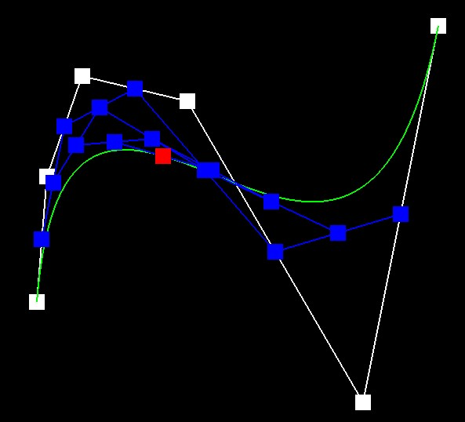
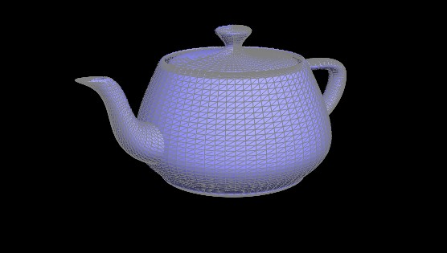
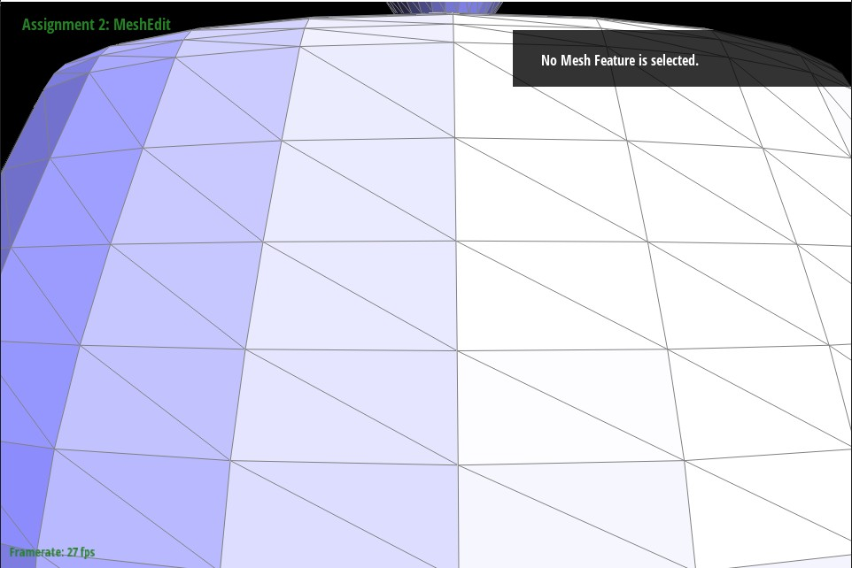
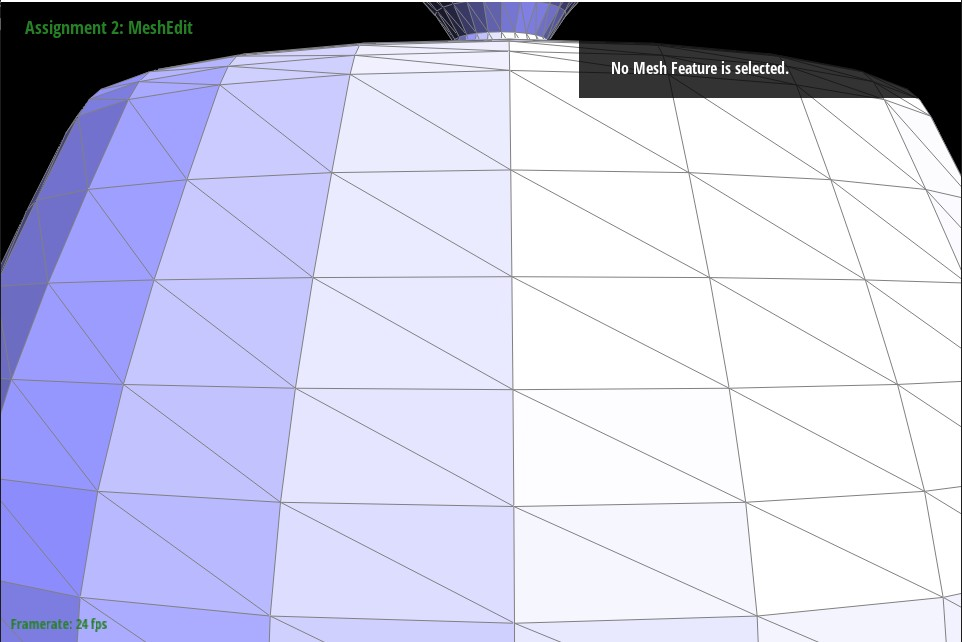
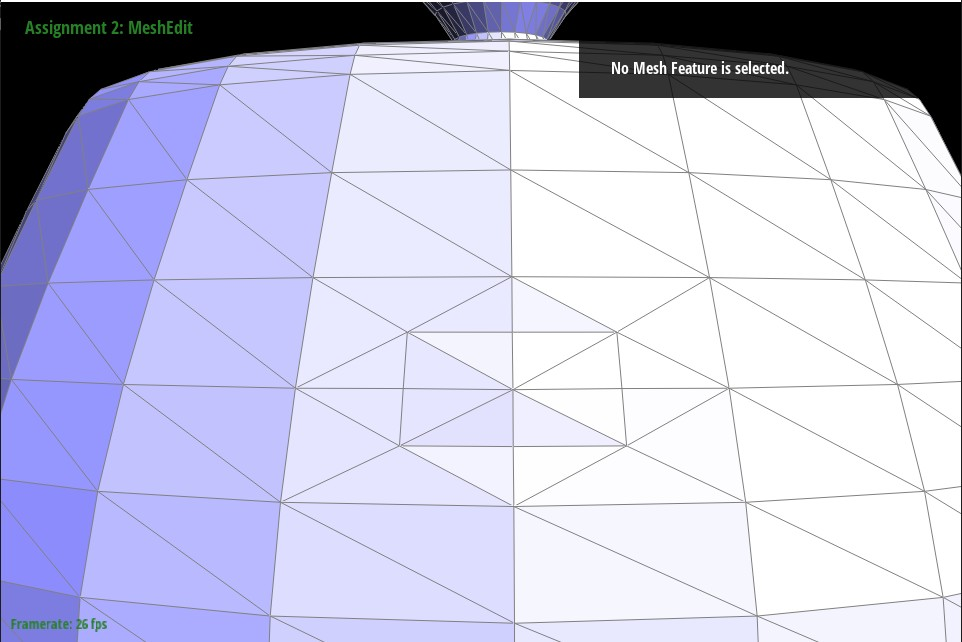
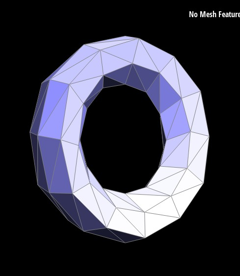
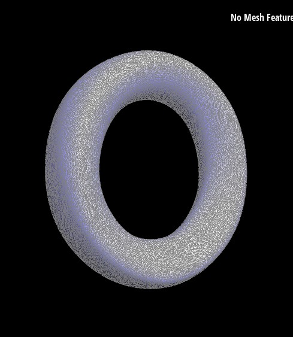
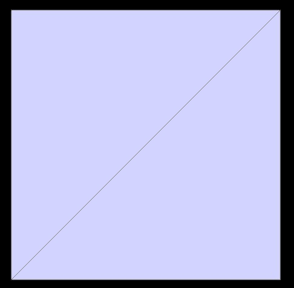

# Project 2: MeshEdit

## Project Overview

In this project, I implemented a number of techniques for generating and working with meshes in 2D and 3D space. I began by implementing support 
for Bezier curves and surfaces, which allow for a generalized way to describe implicit structures in 2 and 3 dimensional space. After that I worked 
on implementing a shading mechanism for meshes as well as a number of operations to alter meshes. This ultimately led to Loop Subdivision, a 
sophisticated algorithm for upscaling the complexity of meshes. 

## Part 1 - Bezier Curves with 1D de Casteljau Subdivision

### Algorithm
This task involves defining a Bezier curve with de Casteljau’s algorithm. At a high level, this algorithm recursively calculates midpoints from given 
points in 2D space through a series of lerps until a final midpoint is reached, which can be used with one last lerp to draw a point on the actual curve.

In more detail, suppose we begin with $N$ points $p_0$ to $p_N$. From this we wish to determine our Bezier curve. To do this we pair up adjacent points 
(i.e. $p_0$ and $p_1$, $p_1$ and $p_2$, etc. all the way up to $p_{N - 1}$ and $p_N$) and take a lerp with parameter $t$ to get a midpoint for each pair. 
This will yield $N - 1$ points on the first iteration of the algorithm. From there we proceed recursively, using each set of lerped points to generate 
another set of points with one fewer element each time. When we have only one point remaining, that point will be on our final curve. We lerp across 
several values of $t$ to draw our whole curve.

Here is a visual demonstration of the algorithm being traced as $t$ ranges from 0 to 1.

### Implementation
My implementation of this algorithm was made simple by use of a few helper functions. To begin, I implemented a basic `lerp` function, which served to 
interpolate two floats, `a` and `b`, across a parameter `t`. I then utilized that helper to implement another helper function, `lerpPoints`, which would 
take two `Vector2D`s (each representing a particular $x, y$ coordinate) and return an interpolated `Vector2D`.

From there, I implemented `evaluateStep`. This involved iterating through the provided list of points, pairing them up, interpolating a new point from 
each pair, and then adding that new point to a list of points to be returned at the end of the function. Thanks to my previously defined helper functions, 
this required only a simple for loop to implement.

0 Iterations                  |  1 Iteration                    | 2 Iterations
:----------------------------------:|:--------------------------------------:|:--------------------------------------:
   |       | 
3 Iterations    | 4 Iterations     | 5 Iterations
   |       | 

Here are the lerp points being calculated at each step when $t = 0.5$. The final image contains the final point on the curve highlighted in red as well as 
the entire Bezier curve in green.

Here is the same set of points, but this time showing the final point when $t$ is a larger value.

## Part 2 - Bezier Surfaces with Separable 1D de Casteljau

### Algorithm
The algorithm in Part 1 can draw only a single curve in 2D space, but de Casteljau’s algorithm can be extended to draw Bezier surfaces in 3D dimensions as 
well. The extended algorithm starts where the previous left off. Assume that we can draw Bezier curves as described in Part 1. We do not need to limit 
ourselves to a single curve. Suppose we draw multiple curves. These curves are two dimensional, so their $z$ coordinates will be parallel. We can take 
advantage of this and stack the curves next to each other by drawing ones whose coordinates are offset on this parallel. Doing this, we would end up with 
something like the below picture.

Notice that each curve is defined by a series of points unique to it.

From here, we can then draw another curve through each of the curves and interpolate a Bezier curve as $t$ varies. How this might look for a single value 
of $t$ can be visualized as such:

All $x, y, z$ points that intersect with this higher order Bezier curve are part of the implicit Bezier surface.

### Implementation

Unlike in Part 1, I implemented the recursive step for this algorithm instead of just a single step. Once again, due to careful use of helper methods, 
the implementation process was easily discretizable.

The first step in implementation is drawing a single Bezier curve in 3D space. To accomplish this, I generalized my Part 1 code to work in three dimensions. The only real change is that I created a variant of my `lerpPoints` function as described above that would lerp three coordinates together instead of two. The `lerp` and `evaluateStep` functions contain only superficial differences from their Part 1 counterparts (i.e. changing a float to a double and declaring a vector of `Vector3D` rather than `Vector2D`s).

The functions described above only do one step of the algorithm however, so I implemented `evaluate1D`, a recursive function that would calculate the points on a single Bezier curve. The function recursively calculates the result of `evaluateStep` until there is only one point returned by the function (recall that the algorithm will always return one fewer point than it takes in, so this always terminates in linear time). 

The final step was the `evaluate` function, which provides parameters `u` and `v`. These parameters represent how far along the curves in the $x$ and $y$ dimensions the values we want to calculate are. To generate the final higher order Bezier curve, I first used the provided control points to generate a number of Bezier curves in accordance with the `u` parameter and the `evaluate1D` function. I placed all these curves into a vector of their own and then used that vector again with the `evaluate1D` function, this time creating only one curve with the argument $v$.

### Results
This allows us to generate rounded surfaces in 3D space. Here is an example of this process being used to generate a teapot.

## Part 3 - Area-Weighted Vertex Normals
The next part of the project switches gears from Bezier curves to working with Halfedges and mesh manipulation. The first thing we will implement is the ability to calculate area-weighted vertex normals.

### Algorithm
For this process we are given a vertex, and from that we want to find every face adjacent to that vertex, sum all the normals of those faces, and finally normalize the whole sum. In the provided code base, the `Halfedge` datastructure is responsible for linking `Vertex`s, `Face`s, and other `Halfedge`s together, so I immediately accessed the starting `Vertex`’s corresponding `HalfedgeCIter`. From there, I was able to get at one of the `Face`s we wanted. To get to the next face and all others thereafter, I went to the `twin()->next` of the current `Halfedge` until I reached the original starting `Halfedge`.

This process allowed me to iterate through all the adjacent faces and get access to their normals, which I then normalized into one vector at the end.

### Results
These normals can be used to create realistic shading on a given mesh. For example, here is the same mesh shaded with two different techniques:

Triangle Shading                 |  Blinn-Phong Shading                 
:----------------------------------:|:------------------------------------:
   |    

Notice that in the left image with flat shading, each quad receives a single color, resulting in a very blocky texture. The right image however, which incorporates the area-weighted vertex normals to implement Blinn-Phong shading, is much more realistic.

## Part 4 - Edge Flip
In this part I implemented edge flipping, perhaps the most tedious and cumbersome thing I have yet had the great displeasure of implementing in code. I began, as is suggested in the spec and on Ed, by writing out every single component on the old and new version of the quad. Here is are my drawings in case you are curious:

From there I set about figuring how various elements would get transformed by this operation. The spec suggests writing out every single assignment, even redundant ones, but I had nowhere near enough patience to do the 50+ assignments out on paper, and even less patience to then enter them all in code, so I made some optimizations. I noticed that the `face`s and `next`s of each halfedge would never change, so I didn’t write any of them out. I also noticed that only the `vertex` of the two halfedges on `e0` would change. Finally, I noticed that the “outside” four edges’ `twin`s were the only things that changed. This dramatically reduced the amount of assignments I needed to make.

Here is the teapot from earlier before and after a few edge flips:

Before                 |  After                
:----------------------------------:|:------------------------------------:
   |   

I was fortunate in that the tedium in this section mostly involved writing out the calculations and debugging was pretty easy. I did have one bug however, and it came as a result of my drawing. What you might notice about the drawing is that it only includes two triangles. This means that it looks like the `next` of `h6` is `h7` and onward. I, not thinking, assumed this was the case which meant that my first implementation would destroy a few edges on the bottom of the quad. Luckily though I was able to spot this issue by just passing through the code again and double checking.

## Part 5 - Edge Split
I used the same technique as the previous part to implement edge splitting. Here is my drawing of what the quad should look like after the split:

This is different than the previous problem as you will notice there are a number of new mesh components. That noted, the implementation was no harder. I just copy pasted all the previous edges (as the initial state of the quad in Parts 4 and 5 is the same) and then created new `Edge`s, `Halfedges`, `Face`s, and `Vertex`s where needed. From there I went to work on the reassignments

As before, I took advantage of the fact that many of the assignments were redundant to cut down on work. However, it was a bit trickier in this one, as the bottom and top of the quad work slightly differently. I chose to “squish” the old non-split `Halfedge`s, `Edges`, and `Face`s into the top half of the quad. This allowed me to reassign many existing components, but for the bottom I had to make many new ones from scratch. Some key observations in terms of cutting down the number of assignments included: you never need to reassign an `Edge` in the old `Halfedge`s, as long as a `Halfedge` is not originating from the new vertex, you do not need to reassign it’s `Vertex`, `h5` through `h9` do not change at all, existing `Edge`s do not need to be reassigned at all. Then I had to set the variables for all the new components. This was more tedious as, since the components were all new, they all had to be initialized. 

Here are some images of the teapot. First before any mesh alterations, then after some edge splits, then after a combination of edge splits and flips

No Alterations                 |  Edge Splits                    | Edge Splits / Flips
:----------------------------------:|:--------------------------------------:|:--------------------------------------:
   |      | 

The only bug I encountered here was the position of the new `Vertex`. I initially averaged the coordinates of all four original vertices when finding the position of the new vertex. This became an issue for me when I started working on Part 6, as edge slips would alter the shape of the mesh in addition to splitting. I had to go back and fix the position to be the average of only `v0` and `v2`, the two vertices which the split edge originally spanned.

## Part 6 - Loop Subdivision for Mesh Upsampling

### Algorithm
Loop Subdivision is an algorithm for increasing the resolution of a mesh iteratively. The first step of the process works by subdividing the triangles of a mesh into smaller subtriangles with updated vertex coordinates, allowing for this higher resolution. This is accomplished by first executing an edge split on every edge in the mesh. This leaves us with a higher resolution mesh, but the individual split triangles will not be a good representation of the structure of the old mesh. To fix this we flip all edges that were not part of the original edge that got split (i.e. the bottom half of a split edge) and connect a new vertex to an old vertex. That satisfies the subdivision of the mesh itself, but we also need to reposition both the old and new vertices as well. To do this we take a weighted sum of the positions of all the old vertices.

### Implementation
The implementation of this algorithm is somewhat complex and involves a number of substeps, each of which I have outlined below. I will explain the reasoning for each step as well as any interesting changes I had to make to the skeleton or previous methods to get the whole thing working together.

#### Computing new positions of old vertices
The first two steps of my algorithm involve calculating the updated positions of the vertices after loop subdivision. The eagle eyed amongst you may notice that this is the last step in my algorithm section, but it is the first step in my implementation. That is because it is greatly beneficial to precompute these values for later. It means that we can work on a simpler mesh since it has not yet been subdivided. Additionally we need to store this value anyways because, since the new positions are based off of the old positions, we would run into issues if we started changing positions before the whole of the computation was done.

To find the new positions of the old vertices, I began by iterating over all the vertices. Since this step happens before the edge splits, iterating over all vertices is equivalent to iterating over only the old vertices. Using a do while loop that I ripped basically straight from the `Halfedge` documentation, I iterated through adjacent vertices and computed a weighted value for the new position by the scheme denoted in the spec. Since we do not want to change the actual positions of the vertices until all the precomputation has concluded, I stored these values in the `newPosition` field of each `Vertex`. Finally, I set all the `Vertex->isNew` fields to false, since they may have been true from a previous run of the algorithm. 

#### Computing new positions of new vertices
I then precompute the positions of all the new vertices (which do not yet exist). This is done by iterating through all edges and navigating the `Halfedge` datastructure to gather the nearest four `Vertex`s to where the new `Vertex` will be, and using their positions to create a weighted sum. Since these vertices do not yet exist, I store this position inside of the edges which will eventually connect to them.

#### Splitting all edges in the mesh
All the work of precomputation done, we can then actually start making changes to the mesh. I iterate through all the edges in the mesh and split the old ones. Although there are no new edges at the start of the algorithm, as we split we will get more and more new edges, so it is necessary to specify that splits can only happen on old edges.

I implemented this with the help of the `splitEdge` method I implemented earlier, but it did require a small change in order to work with my algorithm. When edges are created, as of course occurs in `edgeSplit`, they are created via the `newEdge` method. This method, inexplicably, does not actually set the `isNew` field of the new edge to true, and thus it fell on me to manually set it myself for all the newly created edges. With this change made, `splitEdge` can be used to split edges, and returns the new `Vertex` created by every split. Every time a new `Vertex` is made, I put the precalculated `newPosition`, currently stored in the edge we are splitting, into it.

#### Flipping select edges in the mesh
I then go through and flip all the edges which are not properly orientated. This turned out to be a somewhat difficult problem, as despite what the spec says, you do not actually want to flip every new edge that touches a new and an old vertex. There is a class of edges that should be ignored and never flipped, those being new edges which are the bottom component of a previously split edge. These edges were technically already in the mesh, but due to the edge split have been broken off from the previous edge.

I was having a number of issues flipping the correct edges until I realized there was this additional constraint, but then the issue fell on me to figure out how to actually characterize an edge as a “bottom component”. I ended up editing both `splitEdge` and the class definition of `Edge` itself. I am sure this is probably not what we are meant to do, but I added an extra boolean in the Edge class called `isBottomSplit`, then in `edgeSplit`, I set this field to true for the appropriate edge. This allowed me to figure out which edges were new, as it left the `isNew` boolean unaltered, while also giving me a way to identify bottom components later so I could skip them when flipping.

Those changes made, I was able to iterate through every edge and flip only the appropriate ones.

#### Setting new vertex coordinates
All this done, the final step was simply to update the coordinates of all the vertices, which were stored in their `newPosition` fields.

### Results
Here is the final result of the algorithm are various about of loop subdivision:

0 Iterations                 |  1 Iterations                
:----------------------------------:|:------------------------------------:
   | 
2 Iterations                 | 7 Iterations
   | 

Notice that the main feature of the algorithm is a smoothing out of rough edges. The torus more and more approaches the shape of a smoothed donut with successive iterations of the algorithm.

The cube does not quite divide symmetrically. This is because the initial cube mesh itself is not symmetrical. Take a look at aface of the default mesh:

It consists of two triangles that cut the face in half. The problem is that although the is symmetric in the sense that the same shape is used to subdivide the face, it is not in other ways. For instance, of the four corners in the face, only two of them intersect with the aforementioned triangles.

We can preprocess the mesh to enable a more even split. Since the issue of asymmetry is present in the initial mesh, we can use edge splits to make it more symmetrical before loop subdivision like this:

Subdividing this mesh results in something much more symmetric.

Write up link: https://alexschedel.github.io/AlexSchedel-cs284a-writeups/
