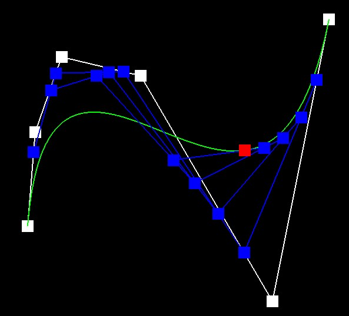
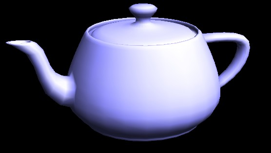
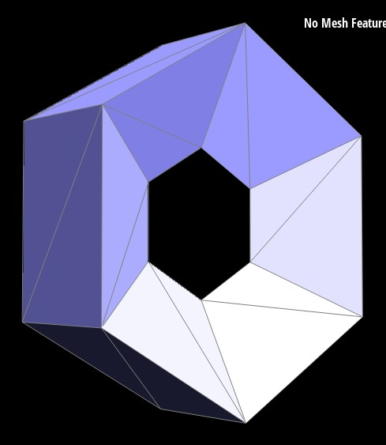
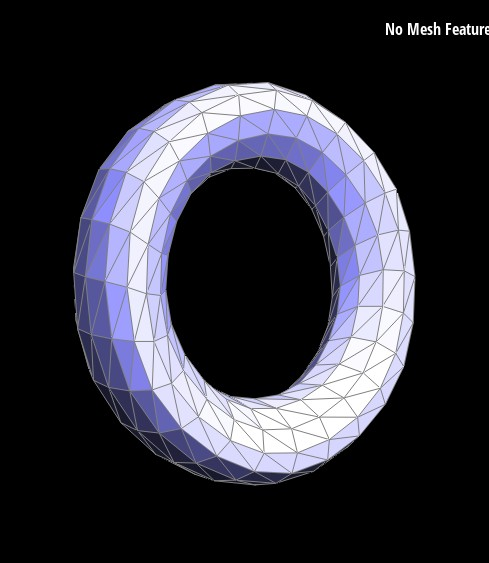
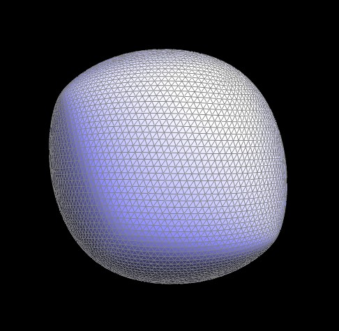
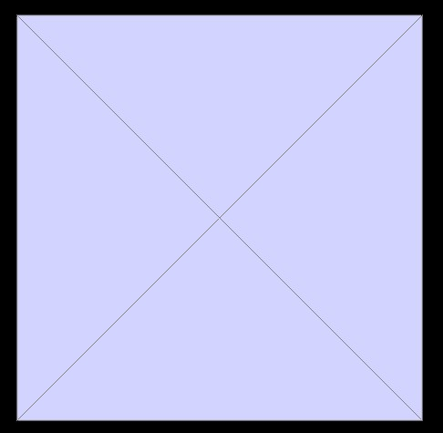

# Project 2: MeshEdit

## Project Overview

## Part 1 - Bezier Curves with 1D de Casteljau Subdivision

### Algorithm

### Implementation

## Part 2 - Bezier Surfaces with Separable 1D de Casteljau

### Algorithm

### Implementation

### Results

## Part 3 - Area-Weighted Vertex Normals

### Algorithm

### Results

## Part 4 - Edge Flip

## Part 5 - Edge Split

## Part 6 - Loop Subdivision for Mesh Upsampling

### Algorithm

### Implementation

#### Computing new positions of old vertices
#### Computing new positions of new vertices
#### Splitting all edges in the mesh
#### Flipping select edges in the mesh
#### Setting new vertex coordinates

### Results

Write up link: https://alexschedel.github.io/AlexSchedel-cs284a-writeups/
