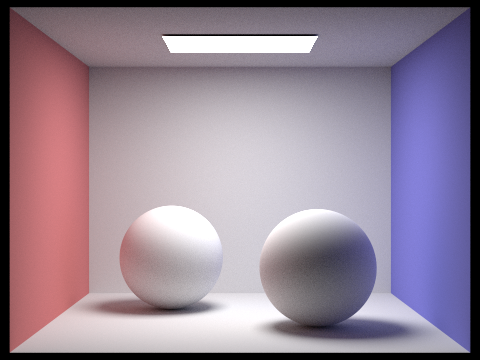
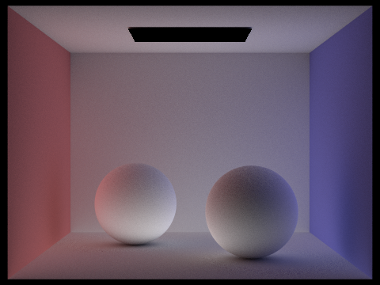
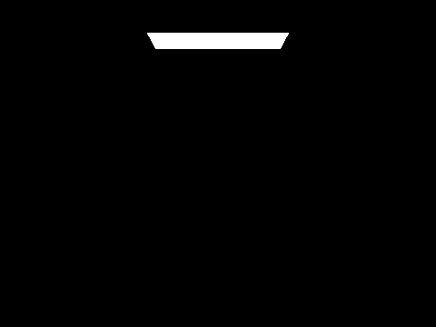

# Project 3: Pathtracer 1

## Overview

In this project, I implemented various ray tracing algorithms, as well as the datastructures needed to make that algorithm fast and computationally viable. I began at a low level by implementing rays themselves, as well as a number of primative techniques for detecting intersections with various types of surfaces. Then I implemented a BVH datastructure, to give me a fast way telling wether or not a given ray intersected with a shape. From there I had the tools neccessary to start implementing various ray tracing algorithms, including, zero, single, and multibounce illumination, as well as light and hemisphere sampled lighting. In the final part of the project, I implemented adaptive sampling in order to further optimizing my ray tracing algorithms.

## Part 1: Ray Generation and Scene Intersection

### Ray Generation

Generating a ray consists of taking an `x` and `y` coordinate in world space, transforming them to camera space, and then instantiating the ray variables.
  
To accomplish this, I first wrote a helper method `transformToCameraSpace` which takes the `x` and `y` and does the transformation. This works by scaling the `x` and `y`, which are initially given as ratios between 0 and 1, to the corresponding size of the camera as indicated in the spec. I then construct a `Vector3D` with those two numbers, as well as a `z` which is always set to -1, as that is how far the camera always is from the world `z`.

After making this transformation, I normalize the vector and create a ray with the `o` set to the provided position, the `d` set to the newly transformed coordinates, and `min_t` and `max_t` set to the front and back clipping planes.

### Primitive Intersections

This is the first randomized sampler of the project. I first created a loop to generate and estimate the radiance of `ns_aa` samples. Within that loop, I create a sample by taking the provided `x` and `y` we wish to estimate and adding a small amount of random noise to each. I think divide these two values by the width and height of the image to get a ratio from 0 to 1 or each and feed those numbers into the ray generation algorithm described above. I then use this slightly noisy ray to estimate a pixel color. Because this is being done in a loop, I add up all of the sampled colors and divide by the number of samples at the end to get the final estimated color.	

### Triangle Intersections

I used the Möller–Trumbore intersection algorithm as described in lecture to implement a triangle intersection test. The algorithm involves taking the dot and cross products of a number of vectors computable from the three points of the triangle and the origin and direction of the ray to calculate $t$, the multiplicative factor that tells us where the ray will intersect with the shape, as well as $b_1$ and $b_2$, which can be used to reconstruct the three barycentric coordinates of the triangle.

After finding these values with the algorithm, I used the barycentric coordinates to calculate the average normal of the triangle. If the new $t$ value I found was greater than $r.min_t$ and less than $r.max_t$ and none of the barycentric coordinates were subzero, that meant that I had found an intersection. From there I updated the values within the `Intersection` struct to reflect this hit.

### Results

After implementing these parts of the project I was able to render a few small images with normal shading:

CBspheres.dae           |  beetle.dae                 
:---------------------:|:-------------------------:
  | 

## Part 2: Bounding Volume Hierarchy

In order to speed up rendering, I implemented a BVH for meshes

### Construction

I constructed the BVH recursively from a number of primitives. Before setting up for recursion, I begin by building a bounding box for the list of primitives. This involves creating the box in the first place and using the `expand` function to potentially increase its size with each new primitive I add. Additionally, as I iterate through the primitives and add them, I keep track of how many there are total for later use. If there are fewer than `max_leaf_size` elements in the mesh to begin with, all we have to do at this point is assign the `start` and `end` pointers of the newly created `BVHNode` and return the node. Otherwise we begin preparing for the recursive call.

There is quite a bit of work needed to set up for the recursive call. Namely, the `construct_bvh` function takes two iterators as arguments. These iterators point to the beginning and end of a list of primitives that will define the shape and size of the bounding box. In order to create the arguments for the recursive calls, we will need to construct new iterators. To do this, I create two `new vector<Primitive*>` objects. Note that they have to be allocated on the heap because a C++ iterator is effectively just a pointer to a (presumably) contiguous memory region. They are vectors because that is a contiguous memory data type. Allocating these iterators on the heap will make sure that they remain valid after the function returns. Once the vectors are created, they then need to be populated with shapes.

Because a BVH has two children per node, we want to split the primitives up generally evenly between our left and right. This requires a heuristic to categorize the shapes. I chose to implement a mean split point heuristic for this part. To accomplish this, when I build the bounding box of each node in the first place, I also add together the coordinates of the centroids of each primitive. By normalizing this value after the end of the loop, I am able to calculate the average position of the `x`, `y`, and `z` coordinates of all primitives in a particular node. However, we only want to split the nodes by one axis, so I simply chose the largest of the three and used that as my split point. Any primitives smaller than that value would go in the left iterator, any greater than or equal to it would go in the right.
All this completed I then make my recursive calls, passing the iterators to each child of the node to recursively construct the rest of the tree.

### Results

Here are some more complex meshes that are only realistically renderable thanks to the acceleration provided by my BVH:

CBlucy.dae           |  CBBunny.dae                 
:---------------------:|:-------------------------:
 | 

For the sake of comparison, I tried rendering the CBbunny.dae mesh with and without BVH acceleration. Here are the results:

. |  With BVH Acceleration | Without BVH Acceleration      
:---------------------:|:-------------------------:|:-------:
Time to Render (sec)| 0.0361 | 71.9470
Avg Interection tests per Ray| 1.819 | 6210.749

As you can see, the timing is almost incomparable given how large the gaps are. The speed up is roughly x24,000. This speed up largely comes from the fact that far fewer intersection tests must be computer per ray, as can be seen in the second row of the above table. There is some overhead associated with the building of the BVH in the first place, but, as is demonstrated by the chart above, that is clearly negligible in comparison to the vast amount of the time the datastructure saves.

## Part 3: Direct Illumination

In this part of the project, I implemented direct lighting in two different ways
  
### Hemisphere Sampling

For this approach, I began by uniformly sampling an incoming ray direction from a hemisphere. This means that I do not take all the different lights into account and acts as a simplifying assumption. Then I needed to generate a ray. I took the direction I sampled, transformed it into world coordinates for the sake of building the ray, and then generated the ray. An additional implementation quirk here is that I set the `min_t` of the ray to be a small epsilon value to make sure the ray would not intersect with the surface it began on.

The ray constructed from the new sample, I then created a new `Intersection` object to check if that bounce intersected with the light. If it does, I calculate the total illuminance as $zero Bounce Illuminance \times bounce Illuminance \times cos\theta_{bounce}$ and add that to the final `L_out`. I sum these samples up, multiply the final value by $2\pi$ to account for the probability of sampling from a uniform hemisphere, and divide at the end to get the total outgoing light.

### Importance Sampling
For this implementation, I sample all the lights directly. For each light in the scene, I first take a sample of the light. Then I determine whether or not I will be incrementing the total light output. This time, instead of interpreting a hit from my second ray as a hit for the light, I do the opposite. I generate a ray in a sample direction, and if that way does not hit anything, that means it is unobstructed, and therefore we should add illuminance to the hit point. One additional implementation note is that although I sample each light a number of times, I only sample a point light source once, since its emittance will never change.

Before I do this I check that the object coord transformed input vector, `wi`, has a `z` coordinate that is greater than 0. If it does not, there is no need to cast the ray because it is behind the hitpoint, meaning it will not add any light to the point. I then construct my ray, this time making sure that its `min_t` is set to a small constant and that its `max_t` is set to the distance between the original hit and the light minus a small constant. This represents the total area that could be shadowed. I intersect the ray, and if it does not hit, I do a similar calculation as before, add to the total light out $(zero Bounce Illuminance \times Bounce Illuminance \times cos\theta_{bounce}) / pdf$. Note that this time I have to divide by the pdf each time, because unlike in hemisphere sampling, the probability of picking any point is not uniform.

### Results

Here is a comparison of a images rendered with each lighting technique:

Hemisphere           |  Importance                 
:---------------------:|:-------------------------:
 | 

Additionally, we can see the effect that changing the number of light samples in light sampling has on the resulting image:

l = 1           |  l = 4 |  l = 16 | l = 64                 
:---------------------:|:-------------------------:|:---------------------:|:-------------------------:
 |   |  | 

As the number of light rays increases, the image becomes clearer and clearer. In particular, notice how the shadows resolve better with higher values of `l`

Overall, light sampling gives us much less noisy and more accurate results. Additionally notice that the light sampled image looks much more rounded and has a better sense of dimension than the hemisphere sampled image. This however can come at a cost, as the light sampling technique is slower, especially as more and more lights are added to the scene.

## Part 4: Global Illumination

The next part of the project involves rendering images with global illumination, meaning images that receive several bounces of light.
  
### Implementation
The implementation of the global illumination algorithm begins with calculating one bound of direct illumination. I use my function from part 3 as a helper method to calculate that. Then we need to determine if we will be sampling further or not with a heuristic. This is required because otherwise we would need to infinitely account for bounces of light.

I implemented three heuristics to determine when we should stop recursion. The simplest of these is just to recurse until we reach a maximum depth. The second is to terminate when we reach a maximum depth for each ray. This involves setting the `depth` field in each created ray. The final heuristic is Russian Roulette. In this approach, we randomly terminate at an arbitrary depth given some probability. I set the change of termination to be 30% for my implementation.

Assuming that we do not terminate, we then generate a ray, just as in the previous part, and intersect it with a world coordinate `w_in`. If it intersects, we recursively intersect again and add the illuminance of that recursive call multiplied by the illuminance of the current call, and a cos$\theta$ term, divided by the pdf, as well as the Russian Roulette probability.

### Results

We can now compare different lighting techniques.

Here are some images generated with global illumination:

Spheres          |  Bunny                 
:---------------------:|:-------------------------:
 | 

Additionally, to get an idea of the components of illumination, here is the same image, first rendered with only direct illulimination, and then with only indirect illumination.

Only Direct          |  Only Indirect                 
:---------------------:|:-------------------------:
 | 

Here is a series of high quality renderings of `CBbunny.dae` with increasing levels of render depth.

m = 0 | m = 1              
:---------------------:|:-------------------------:
 | 
m = 2 | m = 3  
 | 

I also tried to do a depth 100 render, as the spec wants, but ultimately found it to be effectively unrenderable. Even on the staff machines, I was not even able to render 1% of the image after waiting for two hours. Additionally, as you can see, the quality would likely not even be much better as returns diminish very quickly when increasing depth.

Finally, here are several renders of the bunny, each rendered with four light rays and an increasing number of pixel samples

s = 1 | s = 2              
:---------------------:|:-------------------------:
 | 
s = 4 | s = 8  
 | 
s = 16 | s = 64              
 | 
s = 1024 | 
 |

## Part 5: Adaptive Sampling

In the final part of this project I implemented adaptive sampling. Up until now, we have been sampling the same number of times for each pixel in an image. However, some pixels will converge to a single color value faster than others. Adaptive sampling is an algorithm that will allow us to not waste time continuously sampling pixels that have already converged.

To implement it, I added additional logic to the `raytrace_pixel` function. Every `samplesPerBatch` number of samples, I create a value `I`. `I` is equal to the sd / srqt(n), where n is the number of samples so far and sd is defined by the equation in the spec. This `I` value represents the convergence of a particular pixel. If it is above a certain value, I terminate the loop for that particular pixel. This allows me to save time and avoid overexposing certain parts of the image.

Here is a demonstration of how this process saves time. On the left are two rendered images, on the right are heatmaps indicating how many times each pixel was sampled. Notice that some regions are redder and some are bluer. The redder regions were slower to converge, and thefore more sampled. These images we both rendered with `1` = 1, `m` = 5, and `s` = 2048.

Final Image | Sample Rate              
:---------------------:|:-------------------------:
 | 
 | 

### A Final Note

This project took a huge amound of rendering power, and so I primarily employed the Hive for the images you see here. I found myself openning several ssh's in order to monopolize as much processing power as I could to get all these images done quickly. For your amusement, here is an image of what it looked like while I was rendering these images:

## Project Overview
Write up link: https://alexschedel.github.io/AlexSchedel-cs284a-writeups/
