# Project 3-2: Pathtracer 2

## Overview

In this project, I extended my pathtracer from the previous project to support new materials and camera features. This required going back to my previous code and rethinking and expanding on some of the algorithms I employed there. In particular, I chose to focus on rendering new material types by implementing reflective and refractive BSDFs as well as adding the potential for blur into my renders by simulating focal length and aperture size.

## Mirror and Glass Materials (Part 1)

### Implementation

The implementation of this part of the project involved the creation and combination of two new BSDFs, one reflective and one refractive. The reflective one was the easier of the two, as reflection is mathematically somewhat simple. Since the incoming ray needs to leave at the same angle it came from, $w_i$ is calculable with a single line transformation.

Refraction is trickier and boils down to two separate cases: the case when the refracted ray is entering a surface and the case where it is leaving one. Which of the two cases we have can be determined by the sign of the `wo.z` value and results in $\eta$ being equal to either the index of refraction or its reciprocal. This was the main complexity of the refraction function (and one that could be solved quite nicely in one line with the often maligned ternary operator!). However there is one more complexity. Because the angle of refraction is variable, it is possible for the refraction to get lost within the shape. This is known as a “total refraction” and in this case we do not want to return a $w_i$ value at all. In my code I use a formula to determine if this is the case and set `wi` only if it is not. 

The final part of the implementation involved combining these two things to create a glass BSDF. For this, I first check if there is total refraction in a ray, if there is I just return a reflectance. If this is not the case, I will have to choose whether a given ray will be treated as a mirror or as a refractor. Since I have to choose one or the other, I calculate Schlick’s approximation and use that as a random decider to choose.

The main issue I had when completing this part was something that was totally my fault and not really to do with the code at all. In particular, when I was trying to render the refractive sphere in the sample images, I found that it kept coming back totally black regardless of what I did in the code. It turns out that I was using the wrong image and trying to render the as of then unimplemented glass sphere. I was confused and frustrated for almost an hour before realizing that my code had actually been correct the whole time, I was just using the wrong image. 

### Results

Here are images generated with various amounts of light bounce.

m = 0           |  m = 1             
:------------:|:--------------:
 | 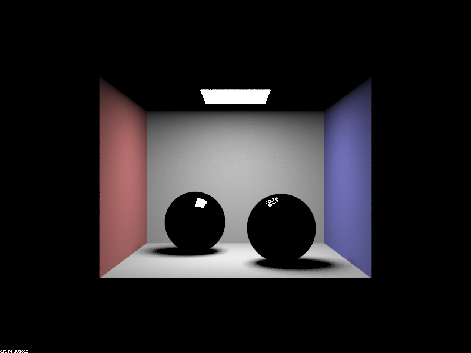
| **m = 2** | **m = 3**  
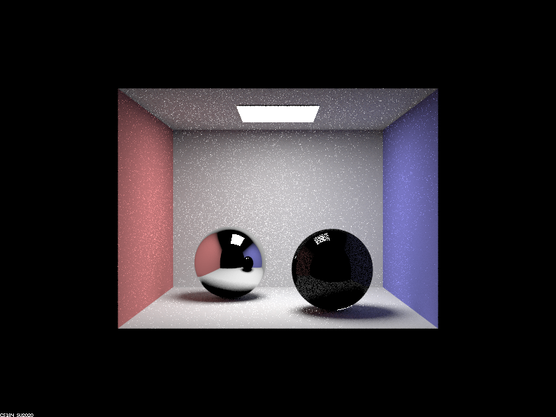 | 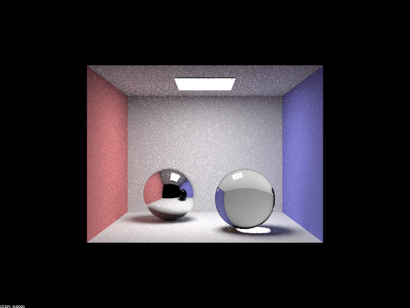
**m = 4** | **m = 5** 
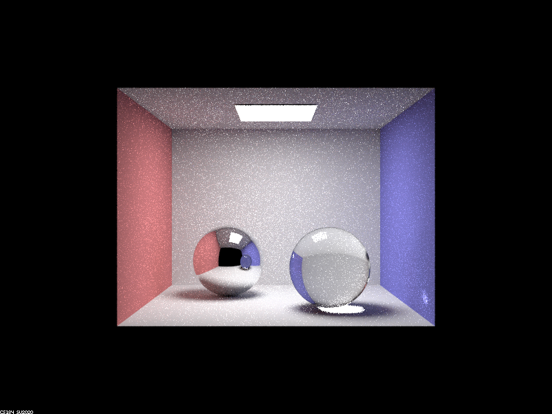 | 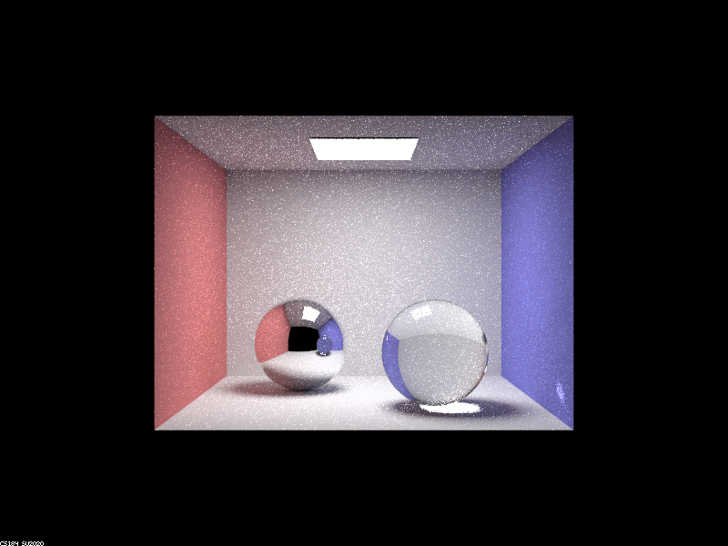
| **m = 100** |   
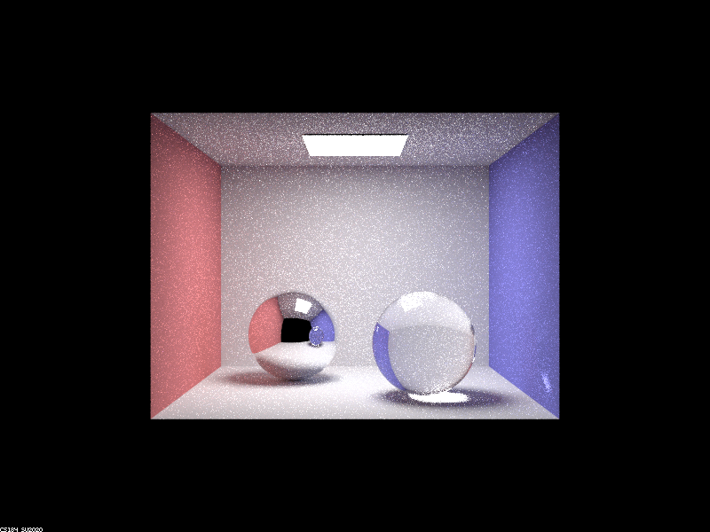 | 

We can look at each image in relation to the previous to see how multibounce effects appear each time the bounce depth is increased.

**m = 0**: This is just the light source since no light has bounced yet

**m = 1**: This is one bounce light. The walls appear as they are being hit from the overhead light source while the ceiling does not as it is at the same level as the light itself. We also see both of our spheres appear in black. Because this is just once bounce light, the spheres have not refracted or reflected anything yet.

**m = 2**: From here on, we have multibounce light. In the left ball we can see a reflection of the screen. This ball is a mirror, so it makes sense that we can get a reflection from it at this point as no light will have had enough bounces to refract through the right ball. Notice however that there is a small amount of reflection on the right ball. This is because we randomly choose between reflection and refraction when evaluating glass surfaces. We also begin to see artifacts on the walls. These come from reflective rays which are getting bounced back into the wall from the spheres and increasing the deposited light in the scene.

**m = 3**: At this point, there have been enough bounces to start getting refraction, so the right ball now appears as glass. Notice that the reflection of the glass ball from within the mirror ball is still black. This is because the rays cannot go deep enough to reflect the updated right ball yet.

**m = 4**: Now the glass ball is reflected by the mirror ball correctly. Additionally, some of the light refracted through the glass ball can be seen collecting on the blue wall.

**m = 5**: At this depth, we generally stop seeing new things in the scene. Because the scene is very simple, there just isn’t really anywhere left that we cannot get to after four bounces. If the scene was more complex (for example if there were more refractive balls in the scene) this could be different.

**m = 100**: As before, there is not really anything new by depth 5, so there is also not much new by depth 100.

## Depth of Field (Part 4)

In this part of the project, I returned back to my original ray generation method from the beginning of project 3-1 and updated it to be able to achieve depth of field effects.

The original rays were generated to operate in line with a pinhole camera model. Because a pinhole model assumes that light can only pass through at one particular point and therefore in only one direction for any particular source, it will show everything in focus and with no blur. Although this results in clearly rendered images, it does not show things the way we as humans see them in the real world. Humans and real world cameras however, operate with lenses. Because there is physical space between the sensor (whether that be a biological sensor in a human or an electronic one in a modern camera) and the lens, things in front of the lens are only in focus at select distances determined by the focal length. We use this observation to create a thin lens model, which, although it is still unrealistic in that it assumes the lens has no width, better approximates the real world.

### Implementation

The implementation of this part began with the very first part of project 3-1. I began by copying over my code for the basic pinhole generation as a starting point. Although this ray would not be the one I would ultimately use to generate the DoF effects, it was instrumental in creating the ray that would.

This image demonstrates why. The ray that has DoF effects is the blue ray. Note that the end point of the blue and rey rays are the same. This means that by multiplying the normalized distance vector of the red ray I would calculate the end point for the blue ray. As for the origin of the blue ray, I took a uniform sample of the coordinates over the x and y coordinates of the lens. The quantities computed, I could create the blue ray and return it, giving me a ray that would allow for DoF effects.

The primary issue encountered when implementing this part of the project was an issue I encountered several times in project 3-1 as well. Namely that I do not seem to understand the difference between world and camera coordinates. Originally, I was accidentally multiplying some of my quantities by the `c2w` matrix two or three times, resulting in a very blurry image. In project 3-1 I mostly just messed around with the matrix multiplications until things seemed to work, and here I took a similar approach. I was eventually able to sort things out by figuring out which quantities needed to be calculated in which space and reordering and multiplying my code as needed.

### Results

Here are the results of changing focal length while keeping other parameters constant. These images were all generated with the command `./pathtracer -t 8 -s 512 -a 64 0.05 -r 640 480 -m 12 -l 4 -b depth -d 4.5 ../dae/sky/CBdragon.dae` where `depth` is changed as indicated by the table above.

depth = 2.5        |  depth = 3.5          
:------------:|:--------------:
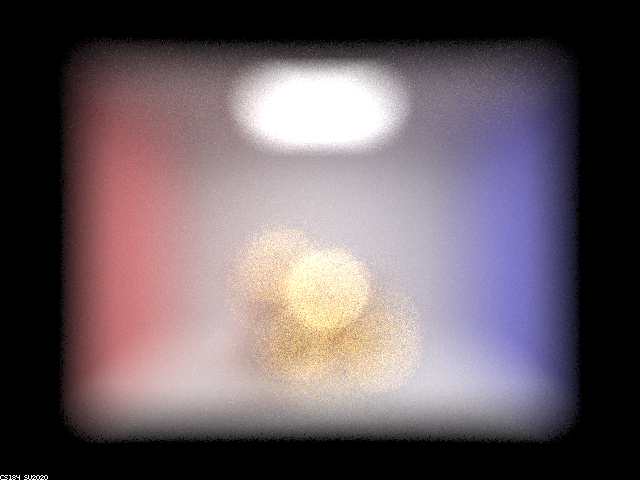 | 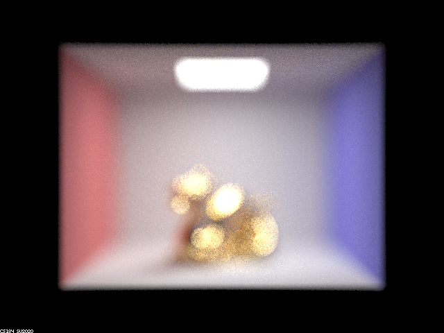
**depth = 4.5** | **depth = 5.5**
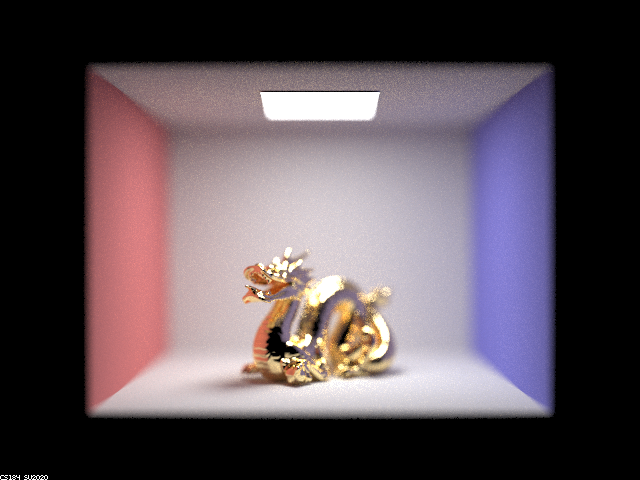 | 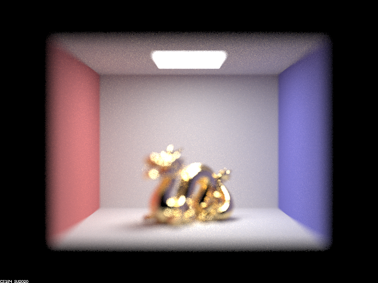

Notice that the image starts out being very out of focus at depth 2.5, becomes clearer at 3.5, is very clear at 4.5, and then blurs again at 5.5. This is because focal length determines at what distance things are in focus in the scene. The optimal focal length for the dragon in the image is somewhere around 4.5, so as we approach that number things get clearer. Similarly, as we get further from it (in either direction) the image becomes blurrier.

Here are the results of changing aperture size while keeping all other parameters the same. All images were generated with the command `./pathtracer -t 8 -s 512 -a 64 0.05 -r 640 480 -m 12 -l 4 -b aperture -d 4.5 ../dae/sky/CBdragon.dae` where `aperture` is varying as noted in the table.

aperture = 0.10    |  aperture = 0.25  
:------------:|:--------------:
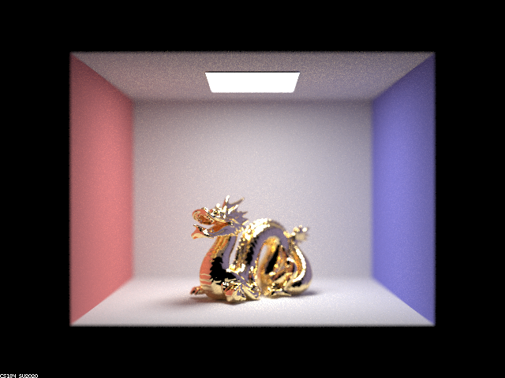 | 
**aperture = 0.50** | **aperture = 0.75**
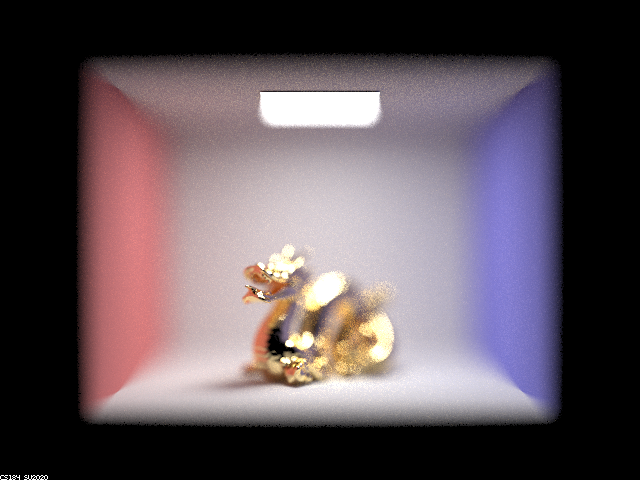 | 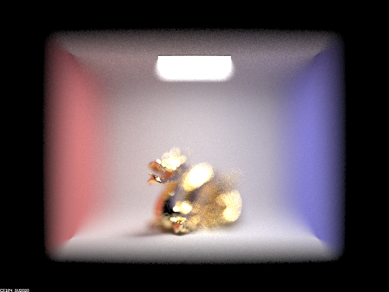

With a small aperture, we approximate a pinhole camera, which is why the image with the smallest aperture is the clearest. From there, as the aperture size increases, the image becomes blurrier and blurrier.

Write up link: https://alexschedel.github.io/AlexSchedel-cs284a-writeups/
